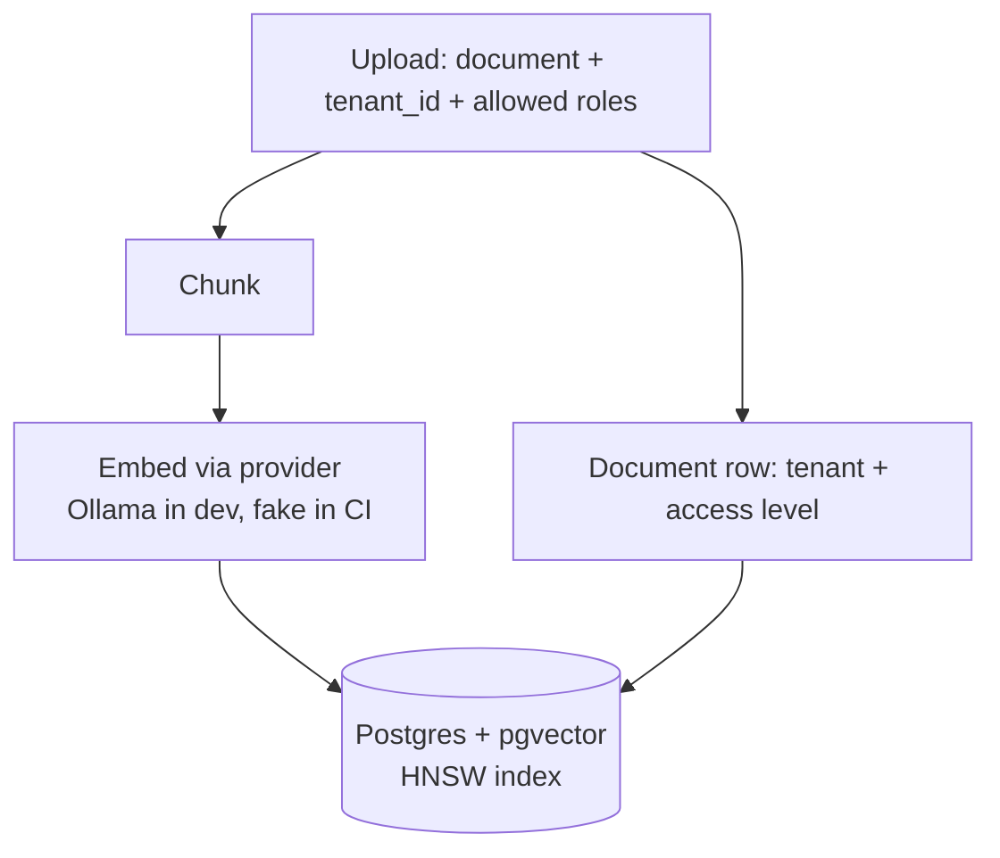

# 🛡️ MultiTenantRAGagnets

### Permission-aware, multi-tenant RAG where the **database** keeps the secrets, not the prompt.

**[The idea](#-the-idea)** · **[How it works](#-how-it-works)** · **[Stack](#-stack)** · **[Proof, not promises](#-proof-not-promises)** · **[Docs](#-docs)**

> [!NOTE]
> **Status: design stage.** This repo holds the planning and context docs only. There is no code yet, and no measured results yet. Every number promised below is something the build must produce, not something already achieved.

---

## 💡 The idea

The naive RAG demo drops every chunk into one vector index and asks the prompt nicely to keep secrets. That leaks the moment similarity search returns **another tenant's chunk**, or a chunk **above the caller's role**. Prompt instructions can't fix it, because the forbidden data is already in the context window.

This design makes one guarantee, enforced at the data layer:

> **A retrieval returns only chunks the caller is permitted to see, and only those chunks are sent to the LLM.**

| 🏢 Tenants | 👥 Roles | 📜 Audit |
|---|---|---|
| Each customer company is isolated from every other | An HR policy is everyone's, a salary memo is HR-only, a board pack is execs-only | Every retrieval is recorded in an append-only log a compliance officer (GDPR, DORA) would ask for |

## 🔐 Two locks, enforced independently

Row-level security is **defence in depth**, not a replacement for the app filter, and the app filter is not a replacement for it. The test suite proves each lock holds on its own.

## ⚙️ How it works

<b>📥 Ingestion</b> — upload, chunk, embed, store

 

Access metadata lives on the **document** and is joined at query time, never copied onto chunks. A revoke or a document move needs **no re-embed**.

<b>🔎 Query</b> — filter first, then search, then answer

 

1. Verify the JWT and extract `tenant` + `role`.
2. `BEGIN`, then `SET LOCAL app.tenant_id` and `app.role_level`. `SET LOCAL` (never a session `SET`) so a pooled connection can't leak context to the next request.
3. Vector search with the tenant and role predicate, with RLS re-applying it underneath.
4. Iterative index scans keep probing until `k` post-filter rows come back, so the filtered search never silently under-returns.
5. Only permitted chunks go into the prompt. The answer cites the chunk ids it used.

<b>🧾 Audit</b> — every query leaves a trail

 

Each query writes an append-only audit row. Full flow in [`docs/APP_FLOW.md`](./docs/APP_FLOW.md).

## 🧰 Stack

| Concern | Choice |
|:--|:--|
| **Service** | ASP.NET Core (.NET) Web API |
| **Store** | Postgres 16 + **pgvector** (vectors and RLS in one engine) |
| **Isolation** | Postgres **row-level security** keyed on per-request session settings |
| **Embeddings + chat** | Provider abstraction: local **Ollama** by default, a deterministic **fake** for CI |
| **Identity** | Locally issued JWT carrying `tenant` + `role` (no SSO) |
| **Surface** | Swagger UI |
| **Run** | `docker compose up` |

## 🧪 Proof, not promises

The build is designed around an eval harness that is built **early, not last**. The plan is to measure and publish:

- 🚫 **Leakage suite.** 200 adversarial queries across tenants and roles, expecting zero leaked chunks, with a **negative control** (filters off) to prove the test can actually fail, and an **RLS-only run** to prove the database lock stands alone.
- 🎯 **Retrieval quality.** recall@k and MRR over a labelled question set.
- ⏱️ **p95 latency.** Retrieval and end-to-end, with corpus size and hardware stated.
- 🔑 **Keyless CI.** The entire harness runs on GitHub Actions with the fake LLM and no secrets.

## 🗺️ Roadmap

A 15-step build, roughly three weeks of evenings, with a defined MVP cut line. See [`docs/IMPLEMENTATION_PLAN.md`](./docs/IMPLEMENTATION_PLAN.md).

## 🚧 Honest threat model

**Defends against:** cross-tenant and cross-role retrieval leakage, via the app filter plus RLS.

**Does not fully defend against:** prompt-injection distortion, token forgery beyond standard signature verification, or the v2 semantic-cache leak.

## 📚 Docs

Read these before writing any code. Start with the TRD.

| | File | What it answers |
|:-:|:--|:--|
| 📐 | [`docs/TRD.md`](./docs/TRD.md) | What the service is, the stack, the access model, security constraints, non-goals |
| 🔀 | [`docs/APP_FLOW.md`](./docs/APP_FLOW.md) | Ingestion, query and per-query audit flows |
| 🛠️ | [`docs/IMPLEMENTATION_PLAN.md`](./docs/IMPLEMENTATION_PLAN.md) | The phased 15-step build order and the MVP cut line |
| ✅ | [`docs/TESTING.md`](./docs/TESTING.md) | Leakage suite, negative control, retrieval quality, latency, keyless CI |
