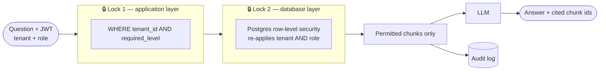
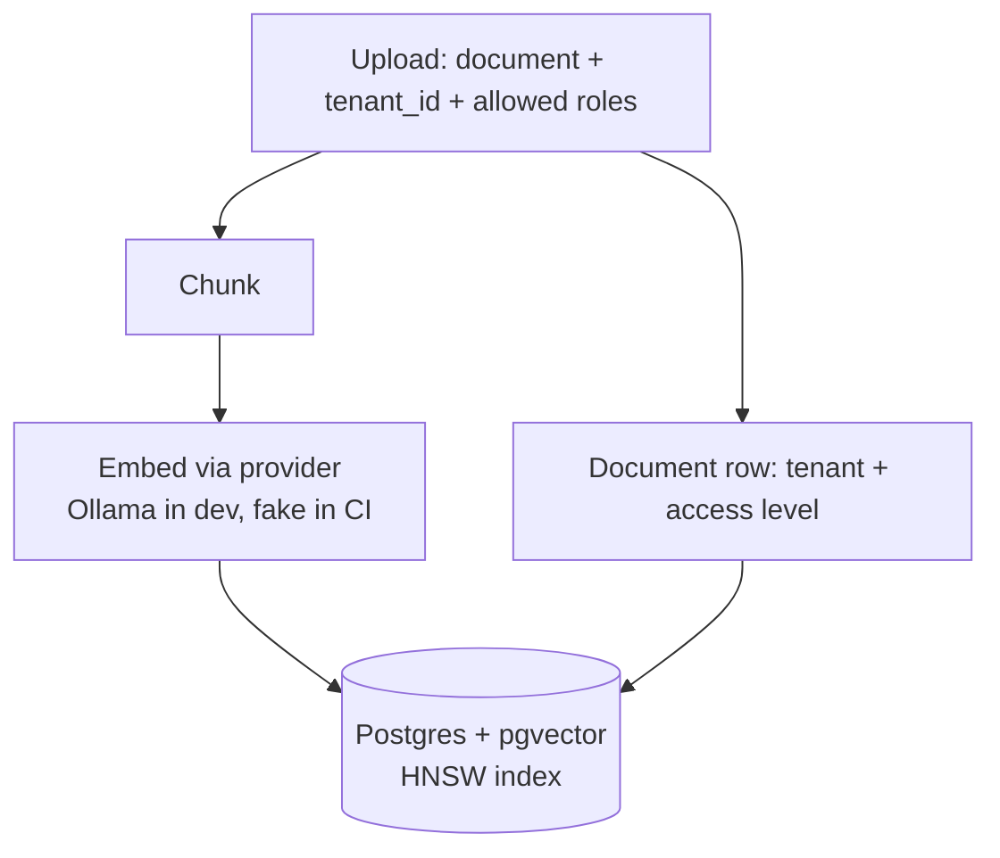

# 🛡️ MultiTenantRAGagnets

### Permission-aware, multi-tenant RAG where the **database** keeps the secrets, not the prompt.

**[The idea](#-the-idea)** · **[How it works](#-how-it-works)** · **[Stack](#-stack)** · **[Proof, not promises](#-proof-not-promises)** · **[Docs](#-docs)**

> [!NOTE]
> **Status: MVP built, with measured results.** The service, schema, RLS policies and the leakage harness are in this repo, and CI runs the whole harness against a real `pgvector/pgvector:pg16` container on every push. Numbers below come from [`results/`](./results/) and are stated with their caveats. Not yet done: a run with real Ollama embeddings (so retrieval *quality* is unmeasured), and a hosted deployment.

---

## 💡 The idea

The naive RAG demo drops every chunk into one vector index and asks the prompt nicely to keep secrets. That leaks the moment similarity search returns **another tenant's chunk**, or a chunk **above the caller's role**. Prompt instructions can't fix it, because the forbidden data is already in the context window.

This design makes one guarantee, enforced at the data layer:

> **A retrieval returns only chunks the caller is permitted to see, and only those chunks are sent to the LLM.**

| 🏢 Tenants | 👥 Roles | 📜 Audit |
|---|---|---|
| Each customer company is isolated from every other | An HR policy is everyone's, a salary memo is HR-only, a board pack is execs-only | Every retrieval is recorded in an append-only log a compliance officer (GDPR, DORA) would ask for |

## 🔐 Two locks, enforced independently

Row-level security is **defence in depth**, not a replacement for the app filter, and the app filter is not a replacement for it. The test suite proves each lock holds on its own.

## ⚙️ How it works

<b>📥 Ingestion</b> — upload, chunk, embed, store

 

Access metadata lives on the **document** and is joined at query time, never copied onto chunks. A revoke or a document move needs **no re-embed**.

<b>🔎 Query</b> — filter first, then search, then answer

 

1. Verify the JWT and extract `tenant` + `role`.
2. `BEGIN`, then `SET LOCAL app.tenant_id` and `app.role_level`. `SET LOCAL` (never a session `SET`) so a pooled connection can't leak context to the next request.
3. Vector search with the tenant and role predicate, with RLS re-applying it underneath.
4. Iterative index scans keep probing until `k` post-filter rows come back, so the filtered search never silently under-returns.
5. Only permitted chunks go into the prompt. The answer cites the chunk ids it used.

<b>🧾 Audit</b> — every query leaves a trail

 

Each query writes an append-only audit row. Full flow in [`docs/APP_FLOW.md`](./docs/APP_FLOW.md).

## 🧰 Stack

| Concern | Choice |
|:--|:--|
| **Service** | ASP.NET Core (.NET) Web API |
| **Store** | Postgres 16 + **pgvector** (vectors and RLS in one engine) |
| **Isolation** | Postgres **row-level security** keyed on per-request session settings |
| **Embeddings + chat** | Provider abstraction: local **Ollama** by default, a deterministic **fake** for CI |
| **Identity** | Locally issued JWT carrying `tenant` + `role` (no SSO) |
| **Surface** | Swagger UI |
| **Run** | `docker compose up` |

## 🧪 Proof, not promises

The harness was built early, not last, and runs keyless in CI (fake LLM, no secrets). Latest committed run: [`results/leakage-results.md`](./results/leakage-results.md), Postgres 16.15 + pgvector 0.8, 4-core GitHub runner.

| Check | Result |
|:--|:--|
| 🚫 **Leakage, full service** (app filter + RLS) | **0 leaks** over 200 adversarial queries, natural and aimed straight at forbidden chunks |
| 🚫 **Leakage, RLS only** (app filter removed) | **0 leaks**, same 200 queries, both variants |
| 🧪 **Negative control, RLS disabled** | **1,868 leaks** detected (735 cross-tenant, 126 cross-role), so the harness can fail |
| 🧪 **Negative control, tenant-only policy** | **880 leaks**, all cross-role, none cross-tenant: the role clause does real work |
| 🎯 **`returned == k`** with 2,500 hostile neighbour rows | exactly `min(k, available)` at k = 1, 5, 10, 20; with iterative scan off it returns 0 |
| ⏱️ **p95 retrieval / end-to-end** (planner default) | 1.4 ms / 2.0 ms on 2,671 rows, fake LLM (about 0 ms), shared CI runner. Forced HNSW path: 6.2 ms / 6.9 ms |

**Read these honestly:**

- Embeddings in CI are a deterministic hash, with no semantics. **recall@5 = 0.345 and MRR = 0.196 (exact search; 0.310 and 0.176 on the forced HNSW path) are harness smoke values, not a retrieval-quality result.** Quality needs a run with real Ollama embeddings.
- Latency is for about 2.7k rows on a shared runner with a fake LLM. It is not a production claim and says nothing about real LLM latency.
- Zero leaks proves the filter and database layers hold under these 200 queries. It does not cover prompt-injection distortion, which is out of scope below.

## 🗺️ Roadmap

A 15-step build with a defined MVP cut line, in [`docs/IMPLEMENTATION_PLAN.md`](./docs/IMPLEMENTATION_PLAN.md). Steps 1 to 13 are done and proven in CI, including the access-change test (a revoke shows on the next query with no re-embed) and the audit-integrity test. Next: a real-embeddings quality run.

## 🚧 Honest threat model

**Defends against:** cross-tenant and cross-role retrieval leakage, via the app filter plus RLS.

**Does not fully defend against:** prompt-injection distortion, token forgery beyond standard signature verification, or the v2 semantic-cache leak.

## 📚 Docs

Read these before writing any code. Start with the TRD.

| | File | What it answers |
|:-:|:--|:--|
| 📐 | [`docs/TRD.md`](./docs/TRD.md) | What the service is, the stack, the access model, security constraints, non-goals |
| 🔀 | [`docs/APP_FLOW.md`](./docs/APP_FLOW.md) | Ingestion, query and per-query audit flows |
| 🛠️ | [`docs/IMPLEMENTATION_PLAN.md`](./docs/IMPLEMENTATION_PLAN.md) | The phased 15-step build order and the MVP cut line |
| ✅ | [`docs/TESTING.md`](./docs/TESTING.md) | Leakage suite, negative control, retrieval quality, latency, keyless CI |
