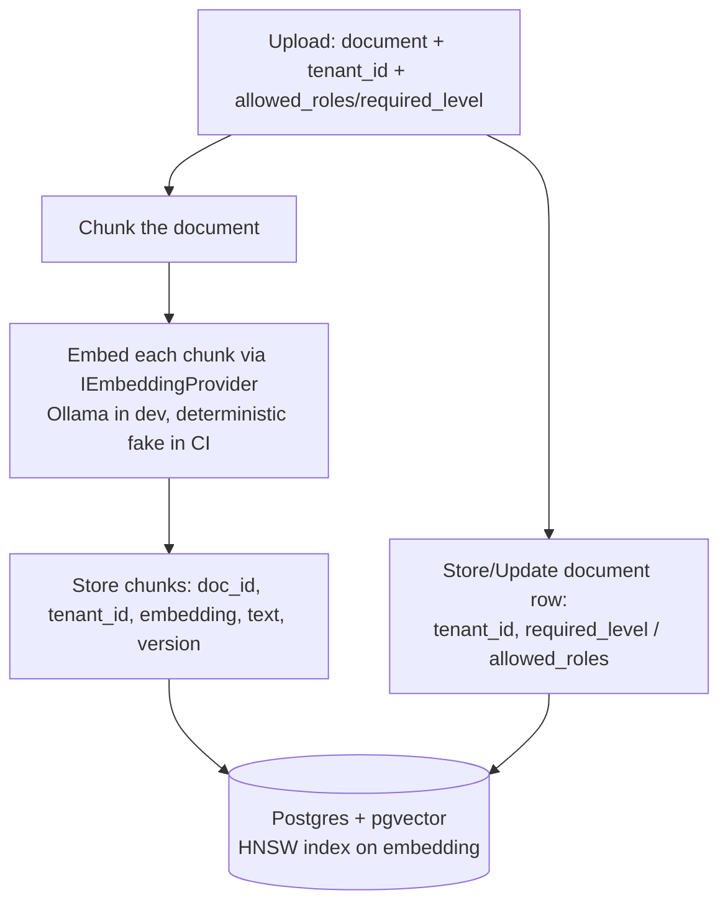
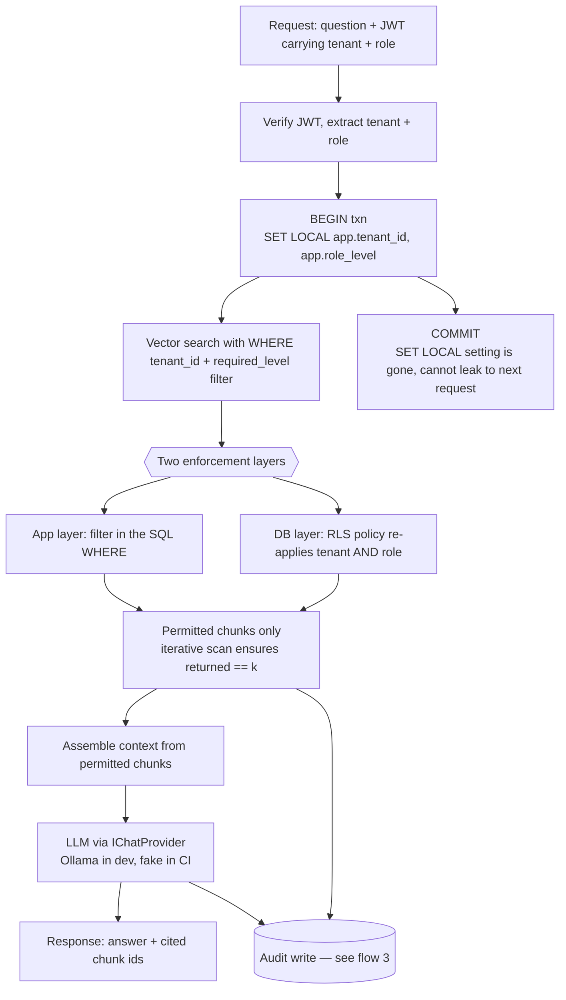
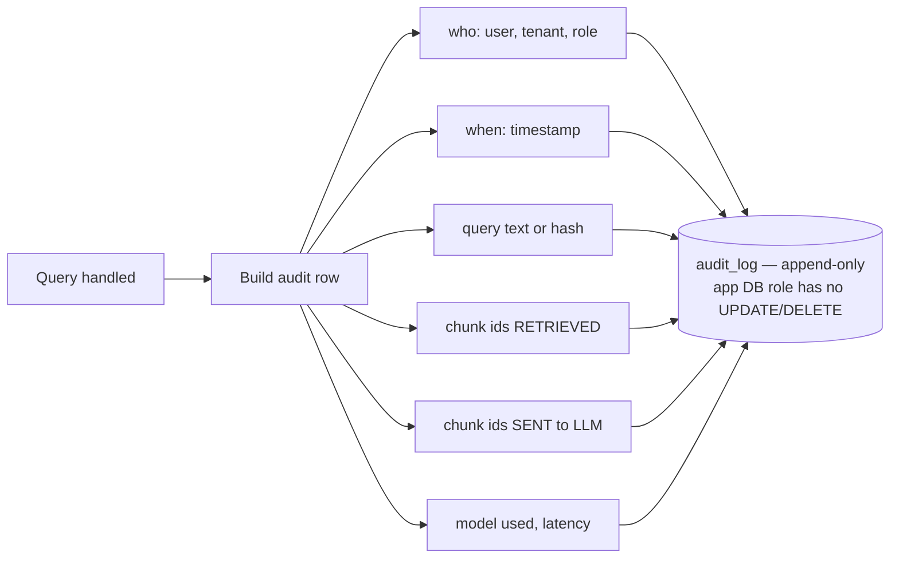

# Application Flow — MultiTenantRAGagnets

This service has no user journey in the UI sense — it is an API. This document
describes the three **data flows** that matter: **ingestion**, **query**, and the
**audit write** that happens on every query. For the stack and the access model see
[`TRD.md`](./TRD.md); for how each flow is tested see [`TESTING.md`](./TESTING.md).

The one rule that shapes every flow: **permission is enforced before retrieval, at
the app layer AND by Postgres RLS**, so the LLM only ever receives chunks the caller
may see.

---

## 1. Ingestion flow

A tenant admin uploads a document with its tenant and the roles allowed to see it.
The document is chunked, each chunk embedded via the provider, and stored with its
tenant id and a link to the document's access metadata.

Steps:

1. **Upload** — document bytes plus `tenant_id` and the allowed roles
   (`required_level`). Access metadata is set on the **document**.
2. **Chunk** — split into chunks. Chunking parameters are fixed and recorded (they
   swing recall — see [`TESTING.md`](./TESTING.md)).
3. **Embed** — each chunk through `IEmbeddingProvider`. The embedding dimension is
   fixed per index and sticky.
4. **Store** — one row per chunk: `doc_id`, `tenant_id`, `embedding`, `text`,
   `version`. The HNSW index is built over the embeddings.

**Key property:** access metadata is stored **on the document and joined at query
time**, never copied onto the chunk. A later revoke or document move needs no
re-embed (see the query flow and [`IMPLEMENTATION_PLAN.md`](./IMPLEMENTATION_PLAN.md)
step 12).

---

## 2. Query flow

A caller asks a question as a specific tenant + role. The tenant/role filter is
applied **before** the vector search, at both layers, and only permitted chunks
reach the LLM.

Steps:

1. **Identity** — verify the locally issued JWT; extract `tenant` and `role`.
2. **Open transaction and set context** — `BEGIN`, then `SET LOCAL app.tenant_id`
   and `SET LOCAL app.role_level` inside that transaction. `SET LOCAL` (never a
   session `SET`) so a pooled connection cannot carry the setting to the next
   request (see [`TRD.md`](./TRD.md) §7.2).
3. **Filter before retrieval, at both layers** — the vector search carries the
   `tenant_id` + role predicate in its `WHERE` (app layer), and the RLS policy
   re-applies the same `tenant AND role` constraint (DB layer). The two must expand
   the role hierarchy identically.
4. **Vector search** — nearest neighbours over the permitted set. **Iterative index
   scans** are on so the filtered ANN query keeps probing until it has `k`
   post-filter rows rather than silently under-returning (see [`TRD.md`](./TRD.md)
   §7.3).
5. **Assemble context** — only the permitted chunks go into the prompt.
6. **LLM** — through `IChatProvider`. The answer cites the chunk ids it used.
7. **Commit** — the `SET LOCAL` context ends with the transaction.

**Fail-closed:** because policies read `current_setting(..., true)`, a request that
somehow reaches the DB without the tenant set returns **0 rows**, never another
tenant's.

---

## 3. Audit write (on every query)

Every query — regardless of outcome — writes exactly one audit row. This is part of
the query flow, called out separately because it is a hard requirement.

- Retrieved chunk ids and sent-to-LLM chunk ids are recorded **separately** — the
  audit integrity test checks these against the response's cited chunk ids (see
  [`TESTING.md`](./TESTING.md)).
- The table is **append-only, enforced by the DB role** (no `UPDATE`/`DELETE`
  grant), not by app convention.
